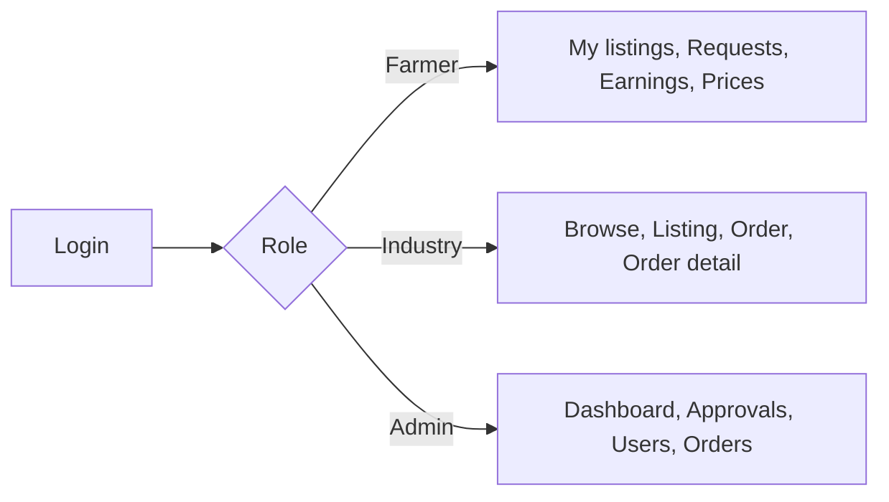

# AgriRevive — Frontend PRD
### Companion to the Backend PRD · React + TypeScript web app for the long-weekend MVP

| | |
|---|---|
| **Product** | AgriRevive – Crop Residue Marketplace (web client) |
| **Companion to** | *AgriRevive – Marketplace PRD* (the backend PRD). Its API (Section 9), business rules (Section 6) and data model (Section 8) are the contract this app is built against. |
| **Stack** | React 18 · TypeScript (strict) · Vite · React Router v6 · Axios · Tailwind CSS |
| **Users** | Farmers (mostly on phones), Industry buyers (desktop), Admin (desktop) |
| **Build window** | Same long weekend, ~4 part-days, in parallel with the backend |

**Contents:** 1 Purpose · 2 Users & UX principles · 3 Tech stack & why · 4 Contract addendum for the backend team · 5 Design system · 6 Routes & access · 7 App plumbing · 8 Page specs · 9 Forms & validation · 10 Order action matrix · 11 Component specs · 12 File-by-file code map · 13 TypeScript types · 14 4-day plan · 15 Testing & QA · 16 Viva cheat sheet · 17 Assumptions

**Precedence:** where this document and Section 11 of the backend PRD disagree on frontend files, **this document wins**.

---

## 1. Purpose

Build a small, clear, mobile-friendly web app that lets three kinds of people run the residue-trading journey from the backend PRD:

> Farmer lists residue → Admin approves → Industry searches and orders → Farmer accepts → Industry pays (held) → Farmer schedules pickup and dispatches → Industry confirms delivery (money released) → Industry rates the farmer.

**The frontend is a thin, honest window onto the backend.** All business rules (who can do what, stock, totals, allowed status changes) live on the server. The frontend's job is to make those rules easy to use and easy to understand, and never to be the only place a rule is enforced.

**Frontend success criteria**
1. Each role sees only its own navigation and pages; wrong-role URLs show a "not allowed" page.
2. A first-time farmer can create a listing on a 360 px-wide phone without help.
3. Every page has a designed loading state, empty state and error state (no blank screens, no raw errors).
4. Any backend validation error appears next to the field it belongs to.
5. The complete happy path runs in the browser with no manual database edits.
6. Every choice can be explained in a viva (Section 16).

---

## 2. Users and UX principles

| User | Device | What they need from the UI |
|---|---|---|
| **Farmer** | Mid-range Android phone, patchy network, may have low literacy | Big buttons, few fields per screen, plain words, icons next to text, clear "what do I do next" hints |
| **Industry buyer** | Office desktop or laptop | Fast search and filters, clear totals, obvious payment step, order history |
| **Admin** | Desktop | Dense but readable tables, quick approve/reject, clear counts |

### Principles (with the reason for each)
1. **Mobile first.** Design for 360 px, then widen. *Farmers are the supply side; without them there is no marketplace.*
2. **Always say what happens next.** Every order status has a one-line hint for the viewer's role (e.g. farmer + `REQUESTED` → "Respond to this request"). *Reduces confusion in a multi-step process.*
3. **The server is the source of truth.** After every action, re-fetch instead of guessing the new state. *Avoids screens that disagree with the database; simpler than optimistic updates.*
4. **Hiding a button is convenience, not security.** The backend still enforces everything. *Frontend checks can be bypassed.*
5. **One way to do each thing.** One API client, one error handler, one set of UI primitives. *Small team, small surface to explain and debug.*
6. **Never a blank screen.** Loading → spinner, no data → empty state with a next step, failure → message with Retry.
7. **Confirm anything that moves money or can't be undone** (pay, confirm delivery, cancel, reject, block user).
8. **Disable buttons while a request is running.** Prevents double payments and double submits.

---

## 3. Tech stack and why

| Choice | Why |
|---|---|
| **React 18 + TypeScript (strict)** | Matches your architecture slide. TypeScript catches wrong field names at compile time, which matters when the API has ~40 endpoints and 4 people. |
| **Vite** | Instant dev server and simple config; standard for new React apps. |
| **React Router v6** | Standard routing; the `<Outlet>` pattern makes role-protected route groups short. |
| **Axios** | One instance with interceptors gives us the auth header and 401 handling in one place. |
| **Tailwind CSS** | Fast, consistent styling without writing separate CSS files; mobile-first breakpoints built in. |
| **react-hook-form** | The app has ~9 forms. It removes boilerplate, handles validation messages, and lets us push backend `fieldErrors` onto fields with `setError`. |
| **react-hot-toast** | One-line success/error toasts. |
| **lucide-react** | Icons next to labels (important for low-literacy users). |
| **No Redux / no React Query** | Local state + one `AuthContext` + URL params is enough for this size. Fewer concepts to learn and explain. |
| **MSW (optional)** | Fake the API in the browser while a backend endpoint isn't ready, without changing app code. Delete handlers as endpoints go live. |
| **Vitest + Testing Library** | Same tooling as Vite; used for a few high-value tests only. |

**Dependencies:** `react`, `react-dom`, `react-router-dom`, `axios`, `react-hook-form`, `react-hot-toast`, `lucide-react`, `tailwindcss`, `postcss`, `autoprefixer`. **Dev:** `typescript`, `vite`, `@vitejs/plugin-react`, `vitest`, `@testing-library/react`, `msw`.

**Environment variables** (`.env.example` is committed, `.env` is not):
```
VITE_API_URL=http://localhost:8080/api
VITE_UPLOADS_URL=http://localhost:8080/uploads
VITE_USE_MOCKS=false
```

---

## 4. Contract addendum (send this to the backend team)

The backend PRD names DTOs but not every field. To avoid N+1 requests and awkward screens, the frontend needs these shapes. **Please treat these as amendments to the backend PRD.** Full TypeScript versions are in Section 13.

1. **`ListingResponse`** includes `farmerId`, `farmerName`, `residueTypeId`, `residueTypeName`, and `imagePath` (relative, may be null).
2. **`OrderResponse`** includes `listingTitle`, `residueTypeName`, `farmerId`, `farmerName`, `buyerId`, `buyerName`, `buyerOrganization`, and **`reviewed: boolean`** (so the UI knows whether to show "Rate farmer").
3. **`OrderDetailResponse`** = `OrderResponse` + `timeline[]` (each event has `fromStatus`, `toStatus`, `changedByName` (null = system), `note`, `changedAt`) + `payment` (nullable).
4. **Money is a JSON number** (e.g. `1750.00`), **dates are `yyyy-MM-dd`**, **timestamps are ISO-8601 strings.**
5. **Validation errors' `fieldErrors` keys must equal the request DTO field names** (`pricePerTonne`, `quantity`, `email`, …). Frontend form field names are identical, which is what makes `applyFieldErrors` work.
6. **`RegisterRequest`**: backend also requires `organizationName` when `role = INDUSTRY`.
7. **CORS** must allow origin `http://localhost:5173`, methods `GET/POST/PUT/PATCH`, and the `Authorization` and `Content-Type` headers.
8. **Swagger UI** enabled from Day 1 (the frontend team reads it constantly).
9. **`GET /admin/users`** returns a `PageResponse<User>`; **`GET /admin/orders`** and **`GET /orders`** return `PageResponse<Order>`.

---

## 5. Design system

### 5.1 Colours (taken from your use-case diagram legend)
| Token | Tailwind | Use |
|---|---|---|
| Brand / primary | `green-700` (hover `green-800`) | Primary buttons, links, logo |
| Farmer accent | `green-600` | Farmer navbar highlight and badges |
| Industry accent | `violet-600` | Industry navbar highlight |
| Admin accent | `amber-600` | Admin navbar highlight |
| Danger | `red-600` | Reject, cancel, block |
| Surface | `white` on `stone-50` page background | Cards on page |
| Text | `stone-900` body, `stone-600` secondary | — |

### 5.2 Type, spacing, shape
- Base font size 16 px (never smaller than 14 px anywhere). System font stack (no web-font download on slow networks).
- Spacing scale: Tailwind defaults; page padding `px-4 md:px-6`, max content width `max-w-6xl mx-auto`.
- Cards: `rounded-xl border bg-white shadow-sm p-4`.
- **Touch targets at least 44 × 44 px** (`min-h-11` on buttons and inputs).

### 5.3 Status badges (text is always shown, never colour alone)

| Order status | Label | Colour |
|---|---|---|
| `REQUESTED` | Awaiting farmer | amber |
| `ACCEPTED` | Accepted – payment due | blue |
| `PAID` | Paid – pickup pending | indigo |
| `PICKUP_SCHEDULED` | Pickup scheduled | teal |
| `IN_TRANSIT` | In transit | orange |
| `DELIVERED` | Delivered | green |
| `REJECTED` | Rejected | red |
| `CANCELLED` | Cancelled | stone/grey |

| Listing status | Label | Colour |
|---|---|---|
| `PENDING_APPROVAL` | Awaiting approval | amber |
| `ACTIVE` | Live | green |
| `REJECTED` | Rejected | red |
| `SOLD_OUT` | Sold out | stone |
| `CLOSED` | Closed | stone |

| Payment status | Label | Colour |
|---|---|---|
| `HELD` | Held safely | blue |
| `RELEASED` | Released to farmer | green |
| `REFUNDED` | Refunded | stone |

### 5.4 The three standard states (every data page must implement all three)
- **Loading:** `<Loader />` centred (skeleton cards optional).
- **Empty:** `<EmptyState icon title message actionLabel onAction />`, e.g. "No listings yet — Create your first listing".
- **Error:** `<ErrorMessage message onRetry />`.

### 5.5 Responsive rules
- Breakpoints: default (mobile), `md` ≥ 768 px, `lg` ≥ 1024 px.
- Grids: 1 column → `md:grid-cols-2` → `lg:grid-cols-3`.
- Lists of records are **cards on mobile**; **admin tables** may scroll horizontally (`overflow-x-auto`) instead of being redesigned.
- Navbar collapses to a hamburger menu below `md`.

### 5.6 Accessibility basics
Visible `<label>` on every input (no placeholder-only fields), `aria-live` on toasts, focus ring on all interactive elements, `alt` text on listing images, modals trap focus and close on `Esc`, colour contrast at least 4.5:1.

### 5.7 Formatting conventions (all through `utils/format.ts`)
| What | Rule | Example |
|---|---|---|
| Money | `Intl.NumberFormat('en-IN', {style:'currency', currency:'INR'})` | ₹1,75,000.00 |
| Quantity | number + ` t` | 12.5 t |
| Date | `Intl.DateTimeFormat('en-IN', {day:'2-digit', month:'short', year:'numeric'})` | 05 Nov 2026 |
| Date + time | same plus `hour:'2-digit', minute:'2-digit'` | 05 Nov 2026, 04:30 pm |
| Price | money + ` / t` | ₹1,800 / t |

---

## 6. Routes and access



| Route | Page | Who | Main API calls |
|---|---|---|---|
| `/login` | `LoginPage` | Public | `login` |
| `/register` | `RegisterPage` | Public | `register` |
| `/` | Redirect via `homePathFor(role)` | Logged in | — |
| `/browse` | `BrowseListingsPage` | Any logged in | `searchListings`, `getResidueTypes` |
| `/listings/:id` | `ListingDetailPage` | Any logged in | `getListing`, `getFarmerReviews`, `placeOrder`; admin: `approveListing`, `rejectListing` |
| `/orders/:id` | `OrderDetailPage` | Participant / Admin | `getOrder` + every order action |
| `/profile` | `ProfilePage` | Any logged in | `getMe`, `updateMe` |
| `/farmer` | `FarmerHomePage` (Should) | Farmer | `getMyOrders`, `getMyListings` |
| `/farmer/listings` | `MyListingsPage` | Farmer | `getMyListings`, `closeListing` |
| `/farmer/listings/new` | `CreateEditListingPage` | Farmer | `createListing`, `uploadListingImage` |
| `/farmer/listings/:id/edit` | `CreateEditListingPage` | Farmer | `getListing`, `updateListing`, `uploadListingImage` |
| `/farmer/orders` | `FarmerOrdersPage` | Farmer | `getMyOrders` + accept/reject |
| `/farmer/earnings` | `EarningsPage` | Farmer | `getMyPayments` |
| `/farmer/insights` | `PricesDemandPage` | Farmer | `getMarketInsights` |
| `/industry/orders` | `IndustryOrdersPage` | Industry | `getMyOrders` |
| `/industry/payments` | `PaymentsPage` (Should) | Industry | `getMyPayments` |
| `/admin` | `AdminDashboardPage` | Admin | `getStats` |
| `/admin/listings` | `AdminListingsPage` | Admin | `getPendingListings`, approve/reject |
| `/admin/users` | `AdminUsersPage` | Admin | `getUsers`, `setUserStatus` |
| `/admin/orders` | `AdminOrdersPage` | Admin | `getAllOrders` |
| `/forbidden` and `*` | `ForbiddenPage`, `NotFoundPage` | Any | — |

**Home per role (`homePathFor`)**: Farmer → `/farmer` (until `FarmerHomePage` is built, `/farmer/listings`) · Industry → `/browse` · Admin → `/admin`.

**Navbar links per role**
- Farmer: My Listings · Requests · Earnings · Prices & Demand · Profile
- Industry: Browse · My Orders · Payments · Profile
- Admin: Dashboard · Approvals · Users · Orders · Profile
- All: Logout

---

## 7. App plumbing (build this first)

### 7.1 API layer
- `api/client.ts` creates one Axios instance (`baseURL = VITE_API_URL`).
- **Request interceptor:** attaches `Authorization: Bearer <token>` from `localStorage` key `agrirevive_token`.
- **Response interceptor:** on **401** calls the registered unauthorized handler (see 7.2). Errors are otherwise passed through unchanged.
- Each `*.api.ts` file exports plain functions that return unwrapped data, e.g.
  ```ts
  export const searchListings = (params: ListingSearchParams) =>
    apiClient.get<PageResponse<Listing>>('/listings', { params }).then(r => r.data);
  ```
- **Components never call Axios directly** — only these functions.

### 7.2 Auth flow
1. `AuthProvider` starts with `initializing = true`. If a token exists in storage, it calls `getMe()`; success → set `user`; failure → clear token. Then `initializing = false`.
2. `login()` / `register()` store the token, set `user`, and the page navigates to `homePathFor(user.role)`.
3. `logout()` clears token and user, navigates to `/login`.
4. `AuthProvider` registers `setUnauthorizedHandler(() => { logout(); toast.error('Session expired, please log in again'); })`. This avoids a circular import between `client.ts` and the context and avoids a hard page reload.
5. `ProtectedRoute({ roles })`: while `initializing` show `<Loader/>`; no user → `<Navigate to="/login" state={{from}} />`; wrong role → `<Navigate to="/forbidden" />`; else `<Outlet/>`.

### 7.3 Data fetching hooks
- `useFetch(fn, deps)` → `{ data, loading, error, reload }`. Cancels stale responses when deps change.
- `useAction(fn, { successMessage })` → `{ run, loading }`. Wraps a mutation: sets `loading`, calls `fn`, shows the success toast or the error toast via `getErrorMessage`, and returns the result (or `undefined` on failure). **All buttons that call the API use this**, which is what guarantees "disabled while running" and consistent messages.
- `useDebounce(value, ms)` for the keyword filter (400 ms).
- `useResidueTypes()` fetches the dropdown data once per app load and caches it in module memory.

### 7.4 Error handling rules (`utils/errors.ts`)
| Situation | What the user sees |
|---|---|
| **400 with `fieldErrors`** | Message under each matching field (`applyFieldErrors(err, setError)`) |
| **400 without `fieldErrors`** (business rule, e.g. "Only 8 tonnes remaining") | Error toast with the server's message |
| **401** | Logged out, redirected to login, "Session expired" toast |
| **403** | Toast "You are not allowed to do that"; on route access → `ForbiddenPage` |
| **404** on a detail page | "Not found" state with a link back |
| **Network error / 500** | "Something went wrong. Please try again." with Retry |

`getErrorMessage(err)` returns the server's `message` when present, else the generic text.

### 7.5 Filters live in the URL
Browse filters (residue type, state, price range, page, sort…) are stored in **URL query params** via `useSearchParams`. Benefits: back button works, results are shareable, refresh keeps filters, and there is no extra state store to explain.

### 7.6 Security notes
- JWT is kept in `localStorage` (simple; XSS trade-off accepted for an MVP; httpOnly cookies are the upgrade path).
- Never use `dangerouslySetInnerHTML`; React escapes all text by default.
- Role-based hiding is UX only; the API enforces roles and ownership.

---

## 8. Page specifications

Format: **Purpose → What's on screen → Actions and API → States/rules.**

### 8.1 Auth pages

**`LoginPage`** (`/login`)
- Email, password, "Log in" button, link to Register.
- Submit → `login()`; success → home for role. Wrong credentials → toast with server message. Blocked user → server message shown.
- If redirected here with `state.from`, return there after login.

**`RegisterPage`** (`/register`)
- Two large role cards at the top: **"I'm a Farmer"** / **"I'm an Industry"** (icons). Only these two roles exist here.
- Fields: name, email, phone, password, confirm password, state (dropdown), district, address; **organization name shown and required only for Industry**.
- Field-level validation from Section 9; backend `fieldErrors` merged onto fields (e.g. "Email already registered").
- Success → logged in and sent to role home.

### 8.2 Shared pages

**`BrowseListingsPage`** (`/browse`, all roles)
```
┌ Browse residue ─────────────────────────────┐
│ [Search…]  [Type ▾] [State ▾] [More filters]│
│ Sort: [Newest ▾]                            │
├─────────────────────────────────────────────┤
│ ┌─image──┐ ┌─image──┐ ┌─image──┐            │
│ │Rice    │ │Bagasse │ │Cotton  │            │
│ │straw   │ │        │ │stalk   │            │
│ │₹1,800/t│ │₹950/t  │ │₹1,200/t│            │
│ │28 t · B│ │60 t · A│ │15 t · C│            │
│ │Ludhiana│ │Pune    │ │Nagpur  │            │
│ └────────┘ └────────┘ └────────┘            │
│            « 1 2 3 »                        │
└─────────────────────────────────────────────┘
```
- Filters: keyword, residue type, state, district, min/max price, min quantity, grade. On mobile, "More filters" opens a collapsible panel.
- API: `searchListings(params)` (only `ACTIVE` with stock, enforced by backend). Default `size=12`.
- Empty: "No listings match your filters" + "Clear filters" button.
- Card click → `/listings/:id`.

**`ListingDetailPage`** (`/listings/:id`)
```
┌ Rice straw – Ludhiana ────── [Live] ┐
│ [ image ]        Farmer: R. Singh ★4.6 (12) │
│ ₹1,800 / tonne   Available: 28 t           │
│ Grade B · Moisture 14% · Punjab, Ludhiana  │
│ Available from 05 Nov 2026                 │
│ Description …                              │
├──────────────────────────────────────────── ┤
│ Place order (industry only)                 │
│ Quantity [__] t   Your price [1800] ₹/t     │
│ Pickup date [__]  Delivery address [____]   │
│ Note [____]                                 │
│ Total: ₹21,000.00        [Send request]     │
└─────────────────────────────────────────────┘
```
- Data: `getListing(id)`, `getFarmerReviews(listing.farmerId)`.
- **By viewer:**
  - *Industry, listing `ACTIVE`*: shows `OrderForm`. Submit → `placeOrder` → navigate to `/orders/:id` with toast "Request sent".
  - *Farmer who owns it*: status badge, `adminRemarks` (if rejected), **Edit** and **Close** buttons; no order form.
  - *Other farmer*: read-only.
  - *Admin, listing `PENDING_APPROVAL`*: **Approve** / **Reject** (reject opens remarks modal, required).
- A non-active listing viewed by someone not allowed returns 404 from the API → "Not found" state.

**`OrderDetailPage`** (`/orders/:id`, participants and admin)
```
┌ Order #42            [Paid – pickup pending] ┐
│ ▸ Next step: Waiting for farmer to schedule  │
│   pickup.                                    │
├──────────────────────────────────────────────┤
│ Rice straw · Farmer: R. Singh · Buyer: Acme  │
│ 12 t × ₹1,750 = ₹21,000.00                   │
│ Delivery to: …                               │
│ Pickup: 08 Nov 2026 · Vehicle PB 10 AB 1234  │
│ Payment: Held safely · Ref MOCK-9f3…         │
├──────────────────────────────────────────────┤
│ Timeline                                     │
│ ● Requested   – Acme, 03 Nov 10:12           │
│ ● Accepted    – R. Singh, 03 Nov 11:40       │
│ ● Paid        – Acme, 03 Nov 12:05           │
├──────────────────────────────────────────────┤
│ [ action buttons for this user and status ]  │
└──────────────────────────────────────────────┘
```
- Data: `getOrder(id)` (with `timeline` and `payment`). Re-fetched after every action (`onChanged → reload`).
- Sections: status header with `nextStepHint`, summary card, pickup/delivery card (only fields that exist), payment card (if payment exists), `OrderTimeline`, `OrderActions`, and, for a `DELIVERED` order not yet reviewed and viewer is the buyer, `ReviewForm`; if reviewed show "You rated this order".
- `rejectionReason` shown prominently for `REJECTED`; cancellation reason appears in timeline note.

**`ProfilePage`** (`/profile`)
- Read/edit name, phone, organization (industry), state, district, address. Email and role are read-only. `updateMe` then `refreshUser()`.

**`ForbiddenPage`, `NotFoundPage`** — friendly message + "Go to home" (uses `homePathFor`).

### 8.3 Farmer pages

**`FarmerHomePage`** (Should)
- Three cards: **Requests waiting** (count of orders `REQUESTED`), **Live listings**, **Awaiting approval**. Each links to the relevant page. Big "Create listing" button.
- Counts from `getMyOrders({status:'REQUESTED', size:1}).totalElements` and `getMyListings()`.

**`MyListingsPage`** (`/farmer/listings`)
- Status tabs: All · Awaiting approval · Live · Rejected · Sold out · Closed (`Tabs`).
- Each listing shown as a card with image, title, stock, price, `StatusBadge`. Rejected listings show the admin's remarks in a red note with an **Edit and resubmit** button.
- Actions: **Edit** (→ edit page), **Close** (`ConfirmDialog` → `closeListing`), **View**.
- Empty: "You haven't listed any residue yet" + Create button.

**`CreateEditListingPage`** (`/farmer/listings/new`, `/:id/edit`)
- Uses `ListingForm` (Section 9.1). In edit mode, loads the listing and prefills; if the listing is `SOLD_OUT`/`CLOSED`, show read-only message.
- Submit (create): `createListing` → if an image was chosen, `uploadListingImage(id, file)` → navigate to `/farmer/listings` with toast "Submitted for approval".
- Submit (edit): `updateListing` (+ optional new image). If listing was `ACTIVE` and type/grade changed, show a warning *before* submit: "Changing the type or grade sends this listing back for approval."

**`FarmerOrdersPage`** (`/farmer/orders`)
- Tabs: Needs action (`REQUESTED`, `PAID`, `PICKUP_SCHEDULED`) · All. Optional status filter dropdown.
- `OrderCard` list, each with compact `OrderActions` (Accept / Reject / Schedule pickup / Mark picked up) and a "View details" link.
- Empty: "No requests yet. Requests appear here when an industry orders your residue."

**`EarningsPage`** (`/farmer/earnings`) — thin wrapper around `PaymentsPanel role="FARMER"`: cards **Held (on the way)**, **Released (in your account)**, **Refunded**, then a payments list (order link, amount, status, date).

**`PricesDemandPage`** (`/farmer/insights`)
- State filter dropdown. One row/card per residue type: average, min, max listed price, tonnes available, **tonnes requested in the last 30 days**, and a simple horizontal bar (CSS `div` width proportional to average price) so farmers can compare at a glance. No chart library.
- Helper text: "Prices are from live listings on AgriRevive."

### 8.4 Industry pages

**`IndustryOrdersPage`** (`/industry/orders`)
- Tabs: Action needed (`ACCEPTED` → pay, `IN_TRANSIT` → confirm) · In progress · Completed · Cancelled/Rejected · All.
- `OrderCard` list with compact `OrderActions` (Pay now, Cancel, Confirm delivery).
- Empty: "No orders yet" + "Browse residue" button.

**`PaymentsPage`** (Should) — `PaymentsPanel role="INDUSTRY"`: totals paid/held/released/refunded and list.

### 8.5 Admin pages

**`AdminDashboardPage`** (`/admin`)
- `StatCard`s: pending approvals (clickable → `/admin/listings`), users by role, listings by status, orders by status, value held, value released.
- Data: `getStats()`.

**`AdminListingsPage`** (`/admin/listings`)
- Defaults to `PENDING_APPROVAL` queue; status filter for others.
- Each row: thumbnail, title, farmer, type, qty, price, grade, submitted date, **View** (→ listing detail), **Approve**, **Reject** (remarks modal, required, ≤ 255 chars).
- After action, row disappears from the queue (re-fetch).
- Empty: "Nothing waiting for approval 🎉".

**`AdminUsersPage`** (`/admin/users`)
- Role filter; table: name, email, role, status, joined; **Block / Unblock** with `ConfirmDialog`. Admin's own row has no block button.

**`AdminOrdersPage`** (`/admin/orders`)
- Status filter; table: id, listing, farmer, buyer, total, status, date; row → `/orders/:id` where admin can **Cancel and refund** (see Section 10).

---

## 9. Forms and validation

Rules: **client checks are for speed; the backend is the authority.** Every form uses react-hook-form. **Field `name`s equal backend DTO field names.** After a failed submit, `applyFieldErrors(err, setError)` puts server messages on the fields.

### 9.1 `ListingForm`
| Field (`name`) | Type | Rules |
|---|---|---|
| `title` | text | required, 5–150 chars |
| `residueTypeId` | select | required (options from `useResidueTypes`) |
| `quantityAvailable` | number (tonnes) | required, > 0, ≤ 100000, step 0.01 |
| `pricePerTonne` | number (₹) | required, > 0 |
| `qualityGrade` | radio A/B/C with descriptions | required |
| `moisturePercent` | number | optional, 0–100 |
| `state` | select (`INDIAN_STATES`) | required |
| `district` | text | required, ≤ 80 |
| `pickupAddress` | textarea | required, ≤ 255 |
| `availableFrom` | date | required, today or later |
| `description` | textarea | optional, ≤ 1000 |
| image (not in DTO) | file via `ImagePicker` | optional, JPG/PNG, ≤ 2 MB, preview shown, error text if rejected |

Grade helper text (suggested wording; adjust to your domain notes): **A** – clean and dry, little contamination · **B** – some moisture or mixed material · **C** – high moisture or contamination.

### 9.2 `OrderForm` (on listing detail, industry only)
| Field | Rules |
|---|---|
| `listingId` | hidden, from the listing |
| `quantity` | required, > 0, ≤ listing's `quantityAvailable`, step 0.01 |
| `offeredPricePerTonne` | required, > 0; defaults to listed price; helper text "Allowed range ₹X – ₹Y" (50%–150% of listed price) |
| `preferredPickupDate` | optional, today or later |
| `deliveryAddress` | required, ≤ 255; prefilled from profile address |
| `buyerNote` | optional, ≤ 500 |

Live "Total" line = `quantity × offeredPricePerTonne` formatted as INR, labelled **"Estimated total"** because the server calculates the real one.

### 9.3 Small forms
| Form | Fields and rules |
|---|---|
| **Login** | `email` (valid), `password` (required) |
| **Register** | `role` (FARMER/INDUSTRY), `name` 2–100, `email` valid, `phone` matches `^[6-9]\d{9}$`, `password` ≥ 8, `confirmPassword` equals password (client only), `organizationName` (required if INDUSTRY), `state`, `district`, `address` optional |
| **Profile** | same optional fields as Register minus email/password |
| **Reject / cancel reason** (modal) | `reason` required, 5–255 |
| **Schedule pickup** (modal) | `pickupDate` required, today or later · `vehicleNumber` required, 6–30 chars, auto-uppercase · `notes` optional ≤ 255 |
| **Confirm delivery** (modal) | `remarks` optional ≤ 255 |
| **Admin reject listing** (modal) | `remarks` required, 5–255 |
| **Review** | `rating` 1–5 (clickable stars, required) · `comment` optional ≤ 500 |

---

## 10. Order action matrix

This table drives `OrderActions`. It lives in one function, `getAvailableActions(order, role)` in `utils/orderActions.ts`, so it can be unit-tested and read in one place. The backend re-checks every action.

| Viewer | Order status | Buttons shown | Extra input | API |
|---|---|---|---|---|
| Farmer (owner) | `REQUESTED` | **Accept**, **Reject** | Reject: reason modal | `acceptOrder`, `rejectOrder` |
| Farmer (owner) | `PAID` | **Schedule pickup** | Modal: date, vehicle, notes | `schedulePickup` |
| Farmer (owner) | `PICKUP_SCHEDULED` | **Mark picked up** | Confirm dialog | `markInTransit` |
| Industry (buyer) | `REQUESTED` | **Cancel request** | Reason modal | `cancelOrder` |
| Industry (buyer) | `ACCEPTED` | **Pay now**, **Cancel** | Pay: confirm dialog showing amount | `payOrder`, `cancelOrder` |
| Industry (buyer) | `IN_TRANSIT` | **Confirm delivery** | Remarks modal + confirm | `confirmDelivery` |
| Industry (buyer) | `DELIVERED` and not `reviewed` | **Rate farmer** | Review form | `createReview` |
| Admin | `ACCEPTED`, `PAID`, `PICKUP_SCHEDULED`, `IN_TRANSIT` | **Cancel and refund** | Reason modal | `adminCancelOrder` |
| Anyone | `DELIVERED`, `REJECTED`, `CANCELLED` | none (terminal) | — | — |

`nextStepHint(status, role)` text, for the header of the order page and cards:

| Status | Farmer sees | Industry sees |
|---|---|---|
| `REQUESTED` | "Respond to this request" | "Waiting for the farmer to respond" |
| `ACCEPTED` | "Waiting for the buyer to pay" | "Pay now to confirm this order" |
| `PAID` | "Schedule the pickup" | "Waiting for the farmer to schedule pickup" |
| `PICKUP_SCHEDULED` | "Mark it picked up when the vehicle leaves" | "Pickup is scheduled" |
| `IN_TRANSIT` | "Waiting for the buyer to confirm delivery" | "Confirm delivery when the load arrives" |
| `DELIVERED` | "Completed. Payment released." | "Completed. Please rate the farmer." |
| `REJECTED` / `CANCELLED` | "Closed" | "Closed" |

---

## 11. Component specs

### UI primitives (`components/ui/`)
| Component | Props | Notes |
|---|---|---|
| `Button` | `variant: 'primary'\|'secondary'\|'danger'\|'ghost'`, `loading`, `icon`, standard button props | Shows spinner and is disabled when `loading` |
| `Fields` (exports `Input`, `Select`, `TextArea`, `FormField`) | `label`, `error`, `hint`, RHF `register` output | `FormField` renders label, control, hint, and error text in one consistent layout |
| `Modal` | `open`, `title`, `onClose`, `children`, `footer` | Focus trap, `Esc` closes, scroll lock |
| `ConfirmDialog` | `open`, `title`, `message`, `confirmLabel`, `danger`, `loading`, `onConfirm`, `onCancel` | Used before every money/destructive action |
| `Badge` | `text`, `color` | Coloured pill |
| `Card` | `children`, `className` | Standard surface |
| `Loader`, `EmptyState`, `ErrorMessage` | see 5.4 | The three standard states |
| `Pagination` | `page`, `totalPages`, `onChange` | Prev / next / page numbers (max 5 shown) |
| `Tabs` | `tabs: {key,label,count?}[]`, `active`, `onChange` | Horizontally scrollable on mobile |
| `StatCard` | `label`, `value`, `icon`, `to?` | Dashboard tiles |
| `RatingStars` | `value`, `onChange?`, `readOnly` | Interactive for the review form, read-only elsewhere |

### Domain components
| Component | Props | Behaviour |
|---|---|---|
| `ListingCard` | `listing` | Image (or placeholder), title, price/t, stock, grade, place, badge; links to detail |
| `ListingFilters` | `value: ListingSearchParams`, `onChange` | Controlled by URL params; debounced keyword |
| `ListingForm` | `initial?`, `onSubmit`, `submitting`, `mode` | Section 9.1 |
| `ImagePicker` | `currentPath?`, `onChange(file\|null)` | Validates type/size, shows preview |
| `OrderForm` | `listing`, `defaultAddress` | Section 9.2; calls `placeOrder` via `useAction` |
| `OrderCard` | `order`, `role`, `onChanged` | Summary + `StatusBadge` + `nextStepHint` + compact `OrderActions` |
| `OrderActions` | `order`, `role`, `onChanged`, `compact?` | Renders buttons from `getAvailableActions`, owns the modals/dialogs for each, calls the API through `useAction`, then `onChanged()` |
| `OrderTimeline` | `events` | Vertical list, oldest first: status label, actor ("System" if null), time, note |
| `PaymentsPanel` | `role` | Summary cards + payment list; wording depends on role |
| `ReviewForm` | `orderId`, `onDone` | Stars + comment |
| `FarmerRatingSummary` | `farmerId` | Fetches `getFarmerReviews`; shows ★ average and count; "No reviews yet" if none |
| `StatusBadge` | `kind: 'order'\|'listing'\|'payment'`, `status` | Reads label/colour from the status maps in Section 5.3 |

---

## 12. File-by-file code map

```
frontend/
├─ index.html · package.json · vite.config.ts · tailwind.config.js
├─ postcss.config.js · tsconfig.json · .env.example
└─ src/
   ├─ main.tsx · App.tsx · index.css
   ├─ api/         auth/        hooks/        utils/
   ├─ types/       constants/   mocks/        components/
   └─ pages/       (auth, common, farmer, industry, admin)
```

### Root and config
| File | Responsibility | Functions / exports |
|---|---|---|
| `main.tsx` | Entry. Optionally starts MSW when `VITE_USE_MOCKS=true`, then renders `<BrowserRouter><AuthProvider><App/><Toaster/></AuthProvider></BrowserRouter>` | `bootstrap()` |
| `App.tsx` | All routes (Section 6), grouped: public, `ProtectedRoute` (any), and one `ProtectedRoute roles=[…]` group per role, wrapped in `AppLayout` | `App()`, `RoleHome()` (redirects using `homePathFor`) |
| `index.css` | Tailwind directives + base styles (font size, focus ring) | — |
| `tailwind.config.js` | Content paths and any brand tweaks | — |
| `.env.example` | The three env vars from Section 3 | — |

### `api/`
| File | Functions |
|---|---|
| `client.ts` | `apiClient` (Axios instance), `getStoredToken()`, `storeToken(t)`, `clearToken()`, `setUnauthorizedHandler(fn)` |
| `auth.api.ts` | `register(body)`, `login(body)`, `getMe()`, `updateMe(body)` |
| `listings.api.ts` | `getResidueTypes()`, `searchListings(params)`, `getListing(id)`, `getMyListings(status?)`, `createListing(body)`, `updateListing(id, body)`, `closeListing(id)`, `uploadListingImage(id, file)` (multipart) |
| `orders.api.ts` | `placeOrder(body)`, `getMyOrders(params)`, `getOrder(id)`, `acceptOrder(id)`, `rejectOrder(id, reason)`, `cancelOrder(id, reason)`, `payOrder(id)`, `schedulePickup(id, body)`, `markInTransit(id)`, `confirmDelivery(id, remarks)` |
| `reviews.api.ts` | `createReview(orderId, body)`, `getFarmerReviews(farmerId)` |
| `payments.api.ts` | `getMyPayments()` |
| `insights.api.ts` | `getMarketInsights(state?)` |
| `admin.api.ts` | `getStats()`, `getPendingListings(params)`, `approveListing(id)`, `rejectListing(id, remarks)`, `getUsers(params)`, `setUserStatus(id, status)`, `getAllOrders(params)`, `adminCancelOrder(id, reason)` |

### `auth/`
| File | Functions / exports |
|---|---|
| `AuthContext.tsx` | `AuthProvider`, `useAuth()` → `{ user, initializing, login, register, logout, refreshUser }` |
| `ProtectedRoute.tsx` | `ProtectedRoute({ roles? })` |

### `hooks/`
| File | Exports |
|---|---|
| `useFetch.ts` | `useFetch<T>(fn, deps)` → `{ data, loading, error, reload }` |
| `useAction.ts` | `useAction(fn, { successMessage? })` → `{ run, loading }` |
| `useDebounce.ts` | `useDebounce(value, ms)` |
| `useResidueTypes.ts` | `useResidueTypes()` (cached) |

### `utils/`
| File | Functions |
|---|---|
| `format.ts` | `formatINR(n)`, `formatPricePerTonne(n)`, `formatTonnes(n)`, `formatDate(s)`, `formatDateTime(s)`, `todayISO()` |
| `errors.ts` | `getErrorMessage(err)`, `getFieldErrors(err)`, `applyFieldErrors(err, setError)` |
| `orderStatus.ts` | `ORDER_STATUS_LABELS`, `ORDER_STATUS_COLORS`, `nextStepHint(status, role)`, `isTerminal(status)` |
| `listingStatus.ts` | `LISTING_STATUS_LABELS`, `LISTING_STATUS_COLORS` |
| `orderActions.ts` | `getAvailableActions(order, role)` → array of action keys (Section 10) |
| `roles.ts` | `homePathFor(role)`, `navLinksFor(role)` |
| `media.ts` | `listingImageUrl(imagePath?)` (uses `VITE_UPLOADS_URL`, returns placeholder path if empty) |
| `validation.ts` | `PHONE_REGEX`, `isTodayOrLater(dateStr)`, shared RHF rule objects |

### `constants/` and `types/`
| File | Contents |
|---|---|
| `constants/states.ts` | `INDIAN_STATES` (array of state names for dropdowns) |
| `constants/grades.ts` | `GRADE_INFO` (label + helper text for A/B/C) |
| `types/index.ts` | All types in Section 13 |

### `mocks/` (optional, only while backend endpoints are missing)
| File | Contents |
|---|---|
| `handlers.ts` | MSW handlers returning fixtures for auth, listings, orders |
| `browser.ts` | `worker = setupWorker(...handlers)` |
| `fixtures.ts` | Sample `User`, `Listing`, `Order` objects |

### `components/`
| Folder / file | Functions / exports |
|---|---|
| `layout/AppLayout.tsx` | `AppLayout()` — Navbar + `<Outlet/>` + footer |
| `layout/Navbar.tsx` | `Navbar()` — links from `navLinksFor(role)`, hamburger on mobile, logout |
| `layout/PageHeader.tsx` | `PageHeader({ title, subtitle?, actions? })` |
| `ui/Button.tsx`, `Fields.tsx`, `Modal.tsx`, `ConfirmDialog.tsx`, `Badge.tsx`, `Card.tsx`, `Loader.tsx`, `EmptyState.tsx`, `ErrorMessage.tsx`, `Pagination.tsx`, `Tabs.tsx`, `StatCard.tsx`, `RatingStars.tsx` | Primitives per Section 11 |
| `StatusBadge.tsx` | `StatusBadge({ kind, status })` |
| `listings/ListingCard.tsx` | `ListingCard` |
| `listings/ListingFilters.tsx` | `ListingFilters` |
| `listings/ListingForm.tsx` | `ListingForm` |
| `listings/ImagePicker.tsx` | `ImagePicker` |
| `listings/FarmerRatingSummary.tsx` | `FarmerRatingSummary` |
| `orders/OrderForm.tsx` | `OrderForm` — `onSubmit()` calls `placeOrder` |
| `orders/OrderCard.tsx` | `OrderCard` |
| `orders/OrderActions.tsx` | `OrderActions` — internal handlers `handleAccept`, `handleReject`, `handlePay`, `handleSchedulePickup`, `handleMarkInTransit`, `handleConfirmDelivery`, `handleCancel`, `handleAdminCancel` |
| `orders/OrderTimeline.tsx` | `OrderTimeline` |
| `orders/ReviewForm.tsx` | `ReviewForm` |
| `payments/PaymentsPanel.tsx` | `PaymentsPanel({ role })` |

### `pages/`
| File | Main internals |
|---|---|
| `auth/LoginPage.tsx` | `onSubmit()` |
| `auth/RegisterPage.tsx` | `onSubmit()`, role card selection state |
| `common/BrowseListingsPage.tsx` | `readParams()` from URL, `updateParams(patch)`, `clearFilters()` |
| `common/ListingDetailPage.tsx` | `handleApprove()`, `handleReject(remarks)`, `handleClose()` |
| `common/OrderDetailPage.tsx` | `reload()` after actions |
| `common/ProfilePage.tsx` | `onSubmit()` |
| `common/ForbiddenPage.tsx`, `NotFoundPage.tsx` | static |
| `farmer/FarmerHomePage.tsx` | — |
| `farmer/MyListingsPage.tsx` | `handleClose(id)` |
| `farmer/CreateEditListingPage.tsx` | `handleCreate()`, `handleUpdate()` |
| `farmer/FarmerOrdersPage.tsx` | tab → status mapping |
| `farmer/EarningsPage.tsx`, `industry/PaymentsPage.tsx` | wrappers around `PaymentsPanel` |
| `farmer/PricesDemandPage.tsx` | state filter, bar width calc |
| `industry/IndustryOrdersPage.tsx` | tab → status mapping |
| `admin/AdminDashboardPage.tsx` | — |
| `admin/AdminListingsPage.tsx` | `handleApprove(id)`, `handleReject(id, remarks)` |
| `admin/AdminUsersPage.tsx` | `handleToggleStatus(user)` |
| `admin/AdminOrdersPage.tsx` | status filter |

### Tests
| File | What it proves |
|---|---|
| `utils/format.test.ts` | INR and date formatting |
| `utils/orderActions.test.ts` | Every role × status combination in Section 10 |
| `utils/errors.test.ts` | `applyFieldErrors` maps server field errors onto form fields |
| `auth/ProtectedRoute.test.tsx` | Redirects when logged out; blocks wrong role |

---

## 13. TypeScript types (`types/index.ts`)

These mirror the backend DTOs from Section 4. Keep field names identical.

```ts
export type Role = 'FARMER' | 'INDUSTRY' | 'ADMIN';
export type UserStatus = 'ACTIVE' | 'BLOCKED';
export type QualityGrade = 'A' | 'B' | 'C';
export type ListingStatus = 'PENDING_APPROVAL' | 'ACTIVE' | 'REJECTED' | 'SOLD_OUT' | 'CLOSED';
export type OrderStatus = 'REQUESTED' | 'ACCEPTED' | 'PAID' | 'PICKUP_SCHEDULED'
                        | 'IN_TRANSIT' | 'DELIVERED' | 'REJECTED' | 'CANCELLED';
export type PaymentStatus = 'HELD' | 'RELEASED' | 'REFUNDED';

export interface User {
  id: number; name: string; email: string; phone: string;
  role: Role; status: UserStatus;
  organizationName?: string | null; state?: string | null;
  district?: string | null; address?: string | null; createdAt?: string;
}
export interface AuthResponse { token: string; user: User; }

export interface ResidueType { id: number; name: string; description?: string | null; }

export interface Listing {
  id: number; farmerId: number; farmerName: string;
  residueTypeId: number; residueTypeName: string;
  title: string; description?: string | null;
  quantityAvailable: number; pricePerTonne: number;
  qualityGrade: QualityGrade; moisturePercent?: number | null;
  state: string; district: string; pickupAddress: string;
  availableFrom: string;            // yyyy-MM-dd
  imagePath?: string | null;        // relative, build URL with listingImageUrl()
  status: ListingStatus; adminRemarks?: string | null; createdAt: string;
}

export interface Order {
  id: number; listingId: number; listingTitle: string; residueTypeName: string;
  farmerId: number; farmerName: string;
  buyerId: number; buyerName: string; buyerOrganization?: string | null;
  quantity: number; pricePerTonne: number; totalAmount: number;
  status: OrderStatus;
  preferredPickupDate?: string | null; pickupDate?: string | null;
  vehicleNumber?: string | null; pickupNotes?: string | null;
  deliveryAddress: string; buyerNote?: string | null;
  rejectionReason?: string | null; deliveryRemarks?: string | null;
  reviewed: boolean; createdAt: string; updatedAt: string;
}
export interface OrderEvent {
  fromStatus?: OrderStatus | null; toStatus: OrderStatus;
  changedByName?: string | null;    // null = system
  note?: string | null; changedAt: string;
}
export interface Payment {
  id: number; orderId: number; amount: number; status: PaymentStatus;
  transactionRef: string; paidAt: string;
  releasedAt?: string | null; refundedAt?: string | null;
}
export interface OrderDetail extends Order { timeline: OrderEvent[]; payment?: Payment | null; }
export interface PaymentSummary {
  totalHeld: number; totalReleased: number; totalRefunded: number; items: Payment[];
}

export interface FarmerReviews {
  averageRating: number; count: number;
  reviews: { id: number; rating: number; comment?: string | null;
             reviewerName: string; createdAt: string }[];
}
export interface MarketInsight {
  residueTypeId: number; residueTypeName: string;
  avgPrice: number; minPrice: number; maxPrice: number;
  activeListings: number; tonnesAvailable: number; tonnesRequestedLast30Days: number;
}
export interface AdminStats {
  usersByRole: Record<Role, number>;
  listingsByStatus: Record<ListingStatus, number>;
  ordersByStatus: Record<OrderStatus, number>;
  pendingApprovals: number; totalHeld: number; totalReleased: number;
}

export interface PageResponse<T> {
  content: T[]; page: number; size: number; totalElements: number; totalPages: number;
}
export interface ApiError {
  timestamp: string; status: number; error: string; message: string; path: string;
  fieldErrors?: Record<string, string>;
}

// Requests
export interface RegisterRequest { name: string; email: string; phone: string; password: string;
  role: 'FARMER' | 'INDUSTRY'; organizationName?: string; state?: string; district?: string; address?: string; }
export interface LoginRequest { email: string; password: string; }
export interface ListingRequest { title: string; residueTypeId: number; quantityAvailable: number;
  pricePerTonne: number; qualityGrade: QualityGrade; moisturePercent?: number; state: string;
  district: string; pickupAddress: string; availableFrom: string; description?: string; }
export interface ListingSearchParams { q?: string; residueTypeId?: number; state?: string; district?: string;
  minPrice?: number; maxPrice?: number; minQuantity?: number; grade?: QualityGrade;
  sort?: string; page?: number; size?: number; }
export interface PlaceOrderRequest { listingId: number; quantity: number; offeredPricePerTonne: number;
  preferredPickupDate?: string; deliveryAddress: string; buyerNote?: string; }
export interface SchedulePickupRequest { pickupDate: string; vehicleNumber: string; notes?: string; }
```

> Backend note: the backend PRD's `PlaceOrderRequest` field for the price must be named `offeredPricePerTonne` to match. Please confirm when writing the DTO.

---

## 14. The 4-day plan (in step with the backend plan)

Suggested split: **Stream C** = auth, layout, public + farmer pages · **Stream D** = UI kit, industry + admin pages. Merge if the team is small.

**Day 0 (1–2 h, before the weekend)** — Scaffold Vite + TS + Tailwind, install dependencies, commit `.env.example`, create empty page files and all routes in `App.tsx` so navigation works, copy `types/index.ts` from Section 13, set up MSW with two fixtures (one listing, one order). *Goal: everyone runs the app and sees placeholder pages.*

| Day | Stream C | Stream D | Milestone |
|---|---|---|---|
| **1** | `client.ts`, `auth.api.ts`, `AuthContext`, `ProtectedRoute`, `AppLayout`, `Navbar`, `roles.ts`, `LoginPage`, `RegisterPage`, `ForbiddenPage`, `NotFoundPage` | UI kit: `Button`, `Fields`, `Modal`, `ConfirmDialog`, `Badge`, `Card`, `Loader`, `EmptyState`, `ErrorMessage`, `Pagination`, `Tabs`; hooks `useFetch`, `useAction`; `format.ts`, `errors.ts`, `validation.ts` | Login/register work against the real backend; each role lands on its home page. Kit merged by mid-day. |
| **2** | `listings.api.ts`, `ListingForm`, `ImagePicker`, `CreateEditListingPage`, `MyListingsPage`, `useResidueTypes` | `ListingCard`, `ListingFilters`, `BrowseListingsPage`, `ListingDetailPage` (read-only part), `AdminListingsPage`, `StatusBadge`, `listingStatus.ts` | Farmer lists → admin approves → industry finds it in Browse. |
| **3** | `orders.api.ts`, `FarmerOrdersPage`, accept/reject/schedule/in-transit modals inside `OrderActions` | `OrderForm` (on listing detail), `IndustryOrdersPage`, `OrderDetailPage`, `OrderCard`, `OrderTimeline`, `OrderActions` (pay, cancel, confirm), `orderStatus.ts`, `orderActions.ts` | **Full happy path in the browser.** |
| **4** | `reviews.api.ts`, `ReviewForm`, `FarmerRatingSummary`, `PricesDemandPage`, `EarningsPage`, `FarmerHomePage`, `ProfilePage` | `AdminDashboardPage`, `AdminUsersPage`, `AdminOrdersPage`, `PaymentsPanel`/`PaymentsPage`; tests; mobile pass on every page | Demo script runs on a phone-width window; QA checklist (Section 15) all ticked. |

**Rule of thumb for Day 2 and 3:** if a backend endpoint isn't ready, add an MSW handler and keep building; delete the handler when the real one lands.

**Cut ladder if behind (drop from the top):**
1. Language toggle, extra polish, skeleton loaders
2. `FarmerHomePage`, `PaymentsPage`, `AdminUsersPage`
3. `PricesDemandPage`
4. `ImagePicker` (use placeholder image), `FarmerRatingSummary`, `ReviewForm`
5. `AdminDashboardPage` stats (keep the approval queue)
6. **Never cut:** auth + route guards, `OrderActions` + `OrderTimeline`, error/loading/empty states on the core flow, disabled-while-loading buttons, the 3–4 unit tests.

---

## 15. Testing and QA checklist

**Automated (small on purpose):** the four test files in Section 12 (`format`, `orderActions`, `errors`, `ProtectedRoute`). `orderActions.test.ts` is the most valuable: it proves the buttons match the state machine.

**Manual, per role**
- **Farmer:** register → create listing with and without image → see "Awaiting approval" → after approval see "Live" → receive request → accept → schedule pickup → mark picked up → see earnings move from Held to Released.
- **Industry:** register → browse, use every filter, reload the page (filters persist) → place order → pay → confirm delivery → rate farmer.
- **Admin:** approve, reject with remarks (farmer sees remarks), block a user (that user gets kicked to login on next request), cancel-and-refund a paid order.

**Cross-cutting**
- Test at **360 px, 768 px, 1280 px** widths. No horizontal page scroll (except admin tables).
- Kill the backend → each page shows the error state with Retry, not a blank screen.
- Delete the token in dev tools → next click returns to login with "Session expired".
- Double-click **Pay now** rapidly → only one payment is created.
- Log in as farmer, type an industry URL (`/industry/orders`) → Forbidden page.
- Submit each form empty → every required field shows its message.
- Trigger a server-side validation error (e.g. price 0 bypassing client check) → message appears under the field.
- Keyboard: tab through the login form and a modal; `Esc` closes modals.

---

## 16. Viva cheat sheet (frontend)

| Likely question | Short answer |
|---|---|
| Why React with TypeScript? | Component reuse across three role-based UIs; TypeScript catches API shape mistakes at compile time. |
| Why no Redux? | The only shared state is the logged-in user (one context). Everything else is page-local or in the URL. Less to learn, less to break. |
| Why keep filters in the URL? | Back button, refresh and sharing all work for free, with no extra state code. |
| If the backend enforces permissions, why hide buttons? | Better UX: users only see actions they can take. It is never the security boundary. |
| How do you stop a double payment click? | Every mutation goes through `useAction`, which disables the button while the request runs; the backend also rejects paying an order that isn't `ACCEPTED`. |
| Where is the JWT stored, and what's the risk? | `localStorage`. Vulnerable if there's an XSS bug; we never render raw HTML and React escapes output. Production upgrade: httpOnly cookies. |
| How is an expired token handled? | Axios response interceptor catches 401, calls the handler registered by `AuthProvider`, which logs out and shows "Session expired". |
| How do server validation errors reach the form? | Form field names equal backend DTO field names; `applyFieldErrors` calls `setError` for each key in `fieldErrors`. |
| Why re-fetch instead of updating local state after an action? | The server is the source of truth, and status changes have side effects (stock, payment). Re-fetching guarantees the screen matches reality. |
| How do you keep frontend types in sync with the backend? | `types/index.ts` mirrors the DTOs, and a shared contract addendum names every field. Upgrade path: generate types from the Swagger/OpenAPI JSON with `openapi-typescript`. |
| How is it usable for farmers? | Mobile-first, large touch targets, icons with labels, one task per screen, plain words, "next step" hints for every status. |
| Why Tailwind? | Fast consistent styling, built-in responsive breakpoints, no separate CSS files to keep in sync. |
| Why MSW? | Lets frontend continue while an endpoint is unfinished, without changing component code. |
| Weaknesses? | English only, no notifications (users must refresh), no offline support, no charts library, manual type mirroring. |

---

## 17. Assumptions and open questions

1. **Backend contract addendum (Section 4) will be adopted.** If the backend team prefers different field names, update `types/index.ts` and this document together.
2. **Industry users land on Browse**, not a dashboard, since search is their main task.
3. **English only** for the MVP; Marathi/Hindi labels are a Could item (a label dictionary and a toggle).
4. **Grade A/B/C descriptions** in Section 9.1 are suggested wording; replace with your own domain definitions.
5. **No charts library.** Prices & Demand uses simple CSS bars.
6. **Design is a clean functional theme** based on your diagram's colour coding, not a full brand design. Swap the Tailwind tokens if you have a logo or brand colours.
7. **No real-time updates.** Users see new statuses when they refresh or navigate; polling or WebSockets are out of scope.
