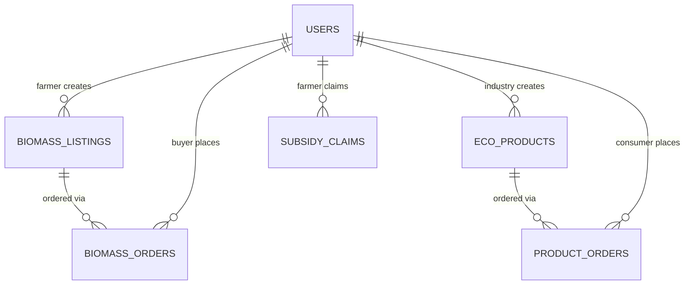

# AgriRevive — Comprehensive Backend PRD
### Circular-Economy Biomass Utilization Platform

| | |
|---|---|
| **Product** | AgriRevive – Crop Residue & Eco-Product Marketplace |
| **This document covers** | Comprehensive Backend API, Database, and Architecture (Enterprise-Grade Scalability) |
| **Stack** | Java 17 · Spring Boot 3 · PostgreSQL · Redis · React + TypeScript |
| **Build window** | Next long weekend, ~4 days, part-days |
| **Coded by** | Humans, organized in a layered modular architecture |

---

## 1. Vision (The Circular Economy)

India generates roughly 500–620 MT of crop residue a year, with 92 MT openly burned, causing severe pollution and economic loss. AgriRevive turns this crisis into a circular-economy opportunity. 

**AgriRevive is an AI-powered marketplace connecting Farmers, Industries, and Consumers.**
1. **Farmers** list crop residue (e.g., sugarcane bagasse, pineapple waste).
2. An **AI Engine** assesses and verifies the quality of the biomass.
3. **Industries** procure this verified biomass to manufacture eco-friendly goods (e.g., vegan leather, furniture, briquettes).
4. **Consumers** purchase these traceable eco-products directly through the platform.

---

## 2. Scope

### In scope (The Comprehensive MVP)
- **Role-based Auth:** Farmer, Industry, Consumer, Admin.
- **Biomass Marketplace:** Farmers list residue, Industries order it.
- **AI Quality Verification:** Mocked AI service to auto-verify biomass quality based on data.
- **Eco-Product Storefront:** Industries list goods made from biomass; Consumers buy them.
- **Logistics & Orders:** Tracking for both Biomass Orders and Eco-Product Orders.
- **Subsidy Claims:** Simple submission module for Farmers to claim government residue-diversion subsidies.
- **Admin Dashboard:** Oversight, analytics, and user management.

### Out of scope (Future Phases)
- **Real AI Model:** MVP uses a deterministic mock engine (Phase 2).
- **Carbon Credits Trading:** (Phase 3).
- **Global Export Marketplace:** (Phase 3).
- **Live GPS Drone Mapping:** (Phase 3).

---

## 3. Roles

| Role | What they can do |
|---|---|
| **Farmer** | Sells biomass, views demand, tracks pickup, claims subsidies. |
| **Industry Buyer** | Buys biomass, lists eco-products (vegan leather, etc.), manages product orders. |
| **Consumer** | Browses eco-products, places orders, tracks delivery, rates products/industries. |
| **Admin** | Manages users, overrides AI approvals, monitors platform analytics. |

---

## 4. The Main Journeys

**Journey A: Farm to Industry (Biomass)**
1. **Farmer** lists 40 tonnes of Sugarcane Bagasse.
2. **AI Engine** runs verification asynchronously and approves the listing -> `ACTIVE`.
3. **Industry** searches for Bagasse, places an order.
4. **Farmer** accepts, schedules pickup. Industry pays (held in escrow).
5. Delivery confirmed; payment released to Farmer.

**Journey B: Industry to Consumer (Eco-Products)**
1. **Industry** creates an eco-product listing: "Bagasse Eco-Chair".
2. **Consumer** browses the storefront and buys the chair.
3. **Industry** dispatches the product.
4. **Consumer** receives it and leaves a 5-star rating.

---

## 5. Data Model & Concurrency

*Note on Scalability:* To handle high concurrency, `biomass_listings` and `eco_products` tables will include a `version` column to utilize **Optimistic Locking**.

---

## 6. Architecture & Scalability (Enterprise-Grade)

To support horizontal scaling and high concurrency for millions of users, the architecture incorporates the following enterprise patterns:

- **Stateless Application Nodes:** All instances run completely statelessly. Authentication is handled via JWTs, meaning any HTTP request can be routed to any backend node behind a Load Balancer.
- **Distributed Caching (Redis):** Frequently accessed, read-heavy data (Active Listings, Eco-Products, Market Insights, Residue Types) are cached in Redis (`@Cacheable`) to massively reduce PostgreSQL load. Cache invalidation happens automatically on writes/updates.
- **Optimistic Locking & Atomic Updates:** Instead of pessimistic row locks (which cause connection bottlenecks under high concurrency), stock reservation uses Optimistic Locking (`@Version`) and atomic SQL updates (`UPDATE ... WHERE stock >= required_qty`) to ensure no overselling without blocking other reads.
- **Database Connection Pooling:** Tuned HikariCP pool to handle concurrent requests efficiently.
- **Asynchronous Processing:** Heavy operations (like the mock AI Verification or generating PDF receipts) use Spring's `@Async` and independent thread pools to prevent blocking the main HTTP request threads.
- **Rate Limiting:** API endpoints are protected against abuse using Redis-backed rate limiting (e.g., Bucket4j).

---

## 7. API Reference (Expanded)

**Auth:**
- `POST /api/auth/register` (FARMER, INDUSTRY, CONSUMER)
- `POST /api/auth/login`

**Biomass (Farm -> Industry):**
- `POST /api/biomass` (Farmer lists)
- `GET /api/biomass` (Industry browses - **Cached in Redis**)
- `POST /api/orders/biomass` (Industry orders)

**Eco-Products (Industry -> Consumer):**
- `POST /api/products` (Industry lists product)
- `GET /api/products` (Consumer browses storefront - **Cached in Redis**)
- `POST /api/orders/products` (Consumer orders)

**AI & Subsidies:**
- `POST /api/ai/verify` (Internal/Admin re-trigger)
- `POST /api/subsidies` (Farmer files claim)
- `GET /api/subsidies` (Admin reviews claims)

---

## 8. The 4-Day Implementation Plan

### Day 1: Foundations, Auth & Caching Setup
**Goal:** Setup, Database, Caching, and Users.
- Generate Spring Boot project (Web, JPA, Security, Validation, PostgreSQL, Flyway, Lombok, **Spring Data Redis**).
- Set up `docker-compose.yml` for **PostgreSQL** AND **Redis**.
- Define `V1__init_schema.sql` (Users, ResidueTypes, BiomassListings, EcoProducts, Orders, Subsidies). Include `version` column for JPA optimistic locking.
- Implement `SecurityConfig`, `JwtService`, and `AuthController` (Stateless).
- Configure Redis Cache Manager and HikariCP connection pooling.

### Day 2: Biomass Marketplace & Async AI Verification
**Goal:** The core Farm-to-Industry supply chain.
- Implement `BiomassListingService` & `BiomassController`.
- Implement `AiVerificationService` using `@Async` to run verification logic in background threads.
- Integrate Spring `@Cacheable` on listing search queries.

### Day 3: Eco-Product Storefront & Consumer Cart
**Goal:** The Industry-to-Consumer retail chain.
- Implement `EcoProductService` & `EcoProductController`.
- Allow Industries to create products and Consumers to browse.
- Ensure store listings are cached and cache is evicted upon new inventory updates.

### Day 4: High-Concurrency Orders, Subsidies & Polish
**Goal:** Tying the financial and logistical knots under high load.
- Implement unified or separated `OrderService`.
- **Stock Management:** Implement Optimistic Locking and Atomic SQL updates to prevent overselling under high concurrency.
- Implement `SubsidyService` (simple CRUD for farmers to lodge claims).
- Rate Limiting integration (Bucket4j + Redis) and final load-testing considerations.

---

## 9. Next Steps
If you are hand-coding the Spring Boot backend, we will follow the Day 1 through Day 4 schedule above. I will act as your co-pilot, guiding you file-by-file through this expanded architecture.
